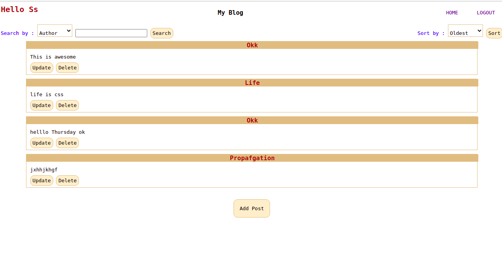
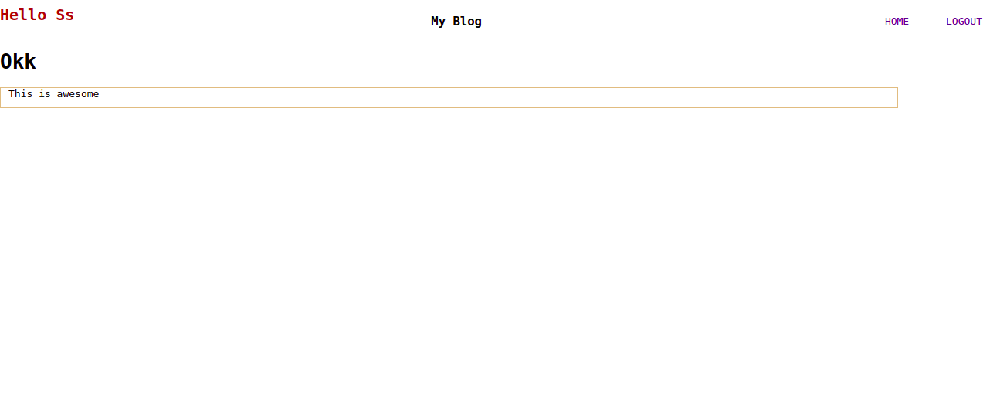
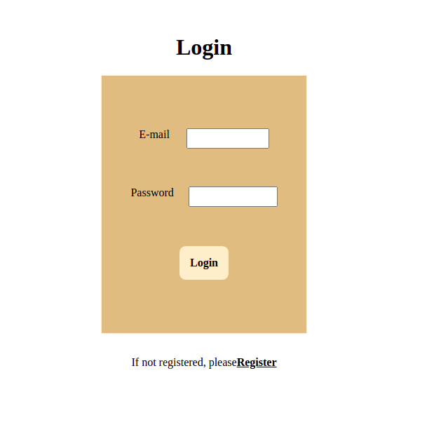
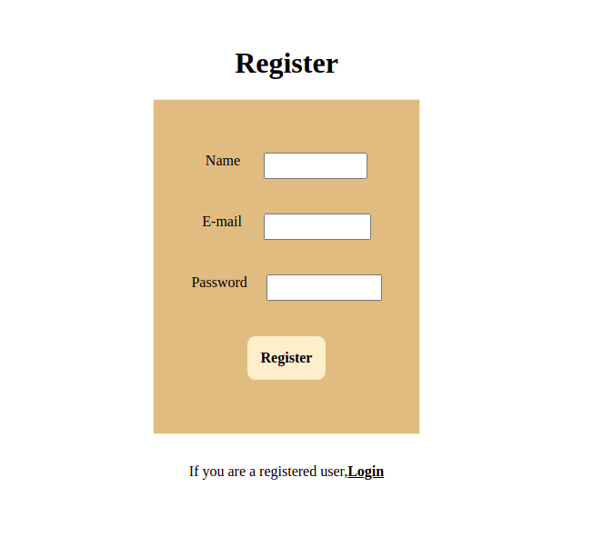
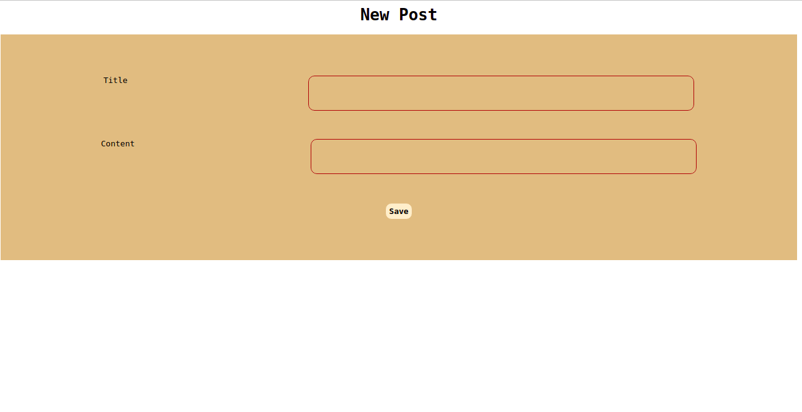
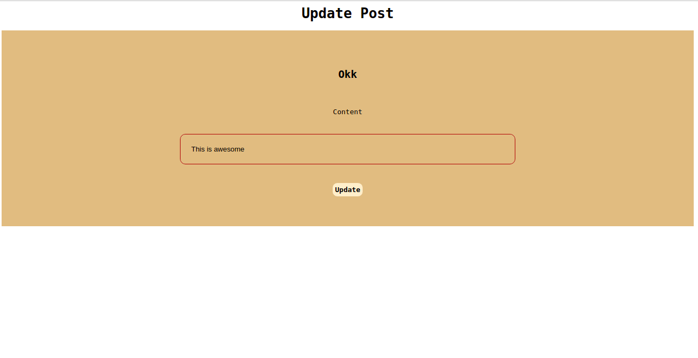

# Blog Application

### Made a blog application with interactive features

# Features
 1. Allows a user to see all posts in the blog.
 2. Read a specific post.
 3. Filter posts by author of post and content keyword.
 4. Sort posts by date.
 5. A user can login to the application.
 6. If doesn't have a account can register.
 7. Authenticated Users can add , delete or upadte any post.

 # Demo
 
 
 





# Technologies Used:

1. JavaScript
2. NodeJS
4. [Express](https://expressjs.com/)

5. [EJS](https://ejs.co/)
5. [Prisma](https://www.prisma.io/docs/getting-started/setup-prisma/start-from-scratch/install-prisma-client-node-postgres/)
6. [Passport](http://www.passportjs.org/docs/)
7. [POSTGRESQL](https://www.postgresql.org/)


# How to run the app

You have to create a `.env` file with following variables:
```
DATABASE_URL

SESSION_SECRET
```
Now run the app :
 ```
 node src/index.js

 ```
 # Resources

 1. [Structuring Express Apps]( https://kentcdodds.com/blog/how-i-structure-express-apps)
2. [Passport Authentication and Express basics](https://www.youtube.com/watch?v=F-sFp_AvHc8)
3. [Undertsanding routes](https://developer.mozilla.org/en-US/docs/Learn/Server-side/Express_Nodejs/routes)

**GitHub [@sanjanasahoo](https://github.com/sanjanasahoo)**
